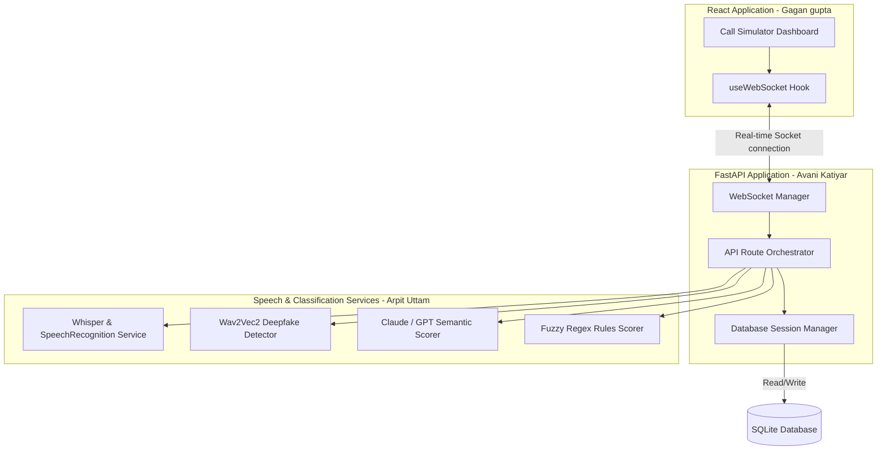

# Digital Arrest Interceptor — AI Public Safety Companion

A real-time, on-device companion-app concept that analyzes call transcripts to detect **"digital arrest" scam patterns** (fake CBI/ED/Customs officer impersonation, psychological isolation tactics, legal urgency creation, and payment coercion) and alerts the user before they act — with a direct escalation path to the **1930 National Cybercrime helpline** or official portal.

---

## 👥 Meet the Team & Architecture

This project was built collaboratively by a team of three developers:
- **Avani Katiyar (Backend & Database):** Re-architected the database models, isolated schemas, and developed the FastAPI route/session routers.
- **Arpit Uttam (ML, DSP & Quality Assurance):** Created the transcription pipelines, audio deepfake Wav2Vec2 inference, fusion scoring model, and the `pytest` suite.
- **Gagan gupta (Frontend & UX):** Designed the React dashboard/simulator UI, extracted websocket streaming into custom React hooks, and organized the asset directory.

### 🏛️ System Architecture



---

## 🛠️ Tech Stack
- **Frontend**: React + Vite, TailwindCSS (cybersecurity/indigo theme, glassmorphism UI), Lucide Icons, and custom SVG Risk Telemetry Gauges.
- **Backend**: FastAPI, Python, WebSockets, Uvicorn.
- **Rules Engine**: Regex & fuzzy keyword matching powered by `rapidfuzz`.
- **LLM Classifier**: Prompts designed for Claude API (Sonnet) & OpenAI GPT-4. Includes an **intelligent local semantic analyzer** if no API keys are present (enabling offline testing).
- **Speech-to-Text**: Supports client-side **Web Speech API** for live microphone capture, and server-side Whisper API integrations.
- **Database**: SQLite database managed via SQLAlchemy for zero-configuration, instant local tracking.
- **Voice Classification**: Audio Deepfake Voice classification metadata analyzer.

---

## 📂 Project Structure

```
Digital-Arrest-Interceptor/
├── .github/
│   ├── ISSUE_TEMPLATE/
│   │   ├── bug_report.md
│   │   └── feature_request.md
│   └── pull_request_template.md
├── CONTRIBUTING.md           # Developer guidelines & branching strategy
├── Makefile                  # Local convenience tasks (run, test, lint, docker)
├── docker-compose.yml        # Multi-container local deployment
├── backend/
│   ├── Dockerfile
│   ├── requirements.txt
│   ├── .env.example
│   ├── main.py               # FastAPI initialization & middlewares
│   ├── app/
│   │   ├── api/              # Endpoints & route handlers (Alice)
│   │   │   ├── endpoints/
│   │   │   │   ├── audio.py
│   │   │   │   ├── incidents.py
│   │   │   │   └── websocket.py
│   │   │   └── router.py
│   │   ├── core/             # Application configs & logging (Alice)
│   │   │   ├── config.py
│   │   │   └── logging.py
│   │   ├── db/               # Database models, connection & schemas (Alice)
│   │   │   ├── models.py
│   │   │   ├── schemas.py
│   │   │   └── session.py
│   │   └── services/         # ML model wrappers & scorer pipelines (Bob)
│   │       ├── deepfake.py
│   │       ├── llm.py
│   │       ├── scorer.py
│   │       ├── transcription.py
│   │       └── websocket.py
│   └── tests/                # Pytest unit & integration suite (Bob)
│       ├── conftest.py
│       ├── test_api.py
│       └── test_scorer.py
└── frontend/
    ├── Dockerfile
    ├── package.json
    ├── .eslintrc.json
    ├── .prettierrc
    ├── .env.example
    └── src/
        ├── App.jsx
        ├── main.jsx
        ├── index.css
        ├── constants/        # Static scenarios (Charlie)
        │   └── scenarios.js
        ├── hooks/            # Custom hooks (Charlie)
        │   └── useWebSocket.js
        └── components/       # Presentational UI components (Charlie)
            ├── AlertCard.jsx
            ├── CallSimulator.jsx
            ├── Dashboard.jsx
            ├── RiskMeter.jsx
            ├── TranscriptView.jsx
            └── VoiceBadge.jsx
```

---

## ⚡ Quick Start Instructions

You can run this application locally or via Docker Compose.

### Option A: Running via Docker Compose (Recommended)

1. Make sure you have Docker installed and running.
2. Build and launch the containers:
   ```bash
   make docker-up
   ```
3. Open your browser to 👉 **[http://localhost:5173](http://localhost:5173)**

---

### Option B: Running Locally

#### 1. Setup & Launch Backend
Open a terminal:
```bash
cd backend
python -m venv venv
# On Windows:
.\venv\Scripts\activate
# On Unix:
source venv/bin/activate

pip install -r requirements.txt
# Run the FastAPI server:
make run-backend
```
*Note: The server will automatically initialize a local database file named `interceptor.db` in the `backend` folder.*

#### 2. Setup & Launch Frontend
Open a second terminal:
```bash
cd frontend
npm install
npm run dev
```

---

## 🛡️ Validation Scenarios Included

You can test the application instantly using the **Scenario Rehearsal** buttons in the UI:
1. **Fake CBI Arrest (Scam)**: Simulates a classic digital arrest call. Watch the risk score raise step-by-step to **96% (RED Warning)** and launch the emergency Alert Card.
2. **Customs Seizure (Scam + AI Cloned Voice)**: Simulates a call claiming a narcotics parcel is seized. Triggers the **Deepfake AI Voice Warning Badge** and raises risk score to **85%**.
3. **Bank Transaction Check (Genuine)**: Standard bank debit checking. Risk remains low (**12% - Green Safe Badge**).
4. **Courier Delivery Check (Genuine)**: Delivery agent request. Risk remains safe.
5. **Live Microphone**: Click the **Live Microphone** button and read scam trigger phrases aloud to watch the rules engine highlight and update threat scores dynamically!
